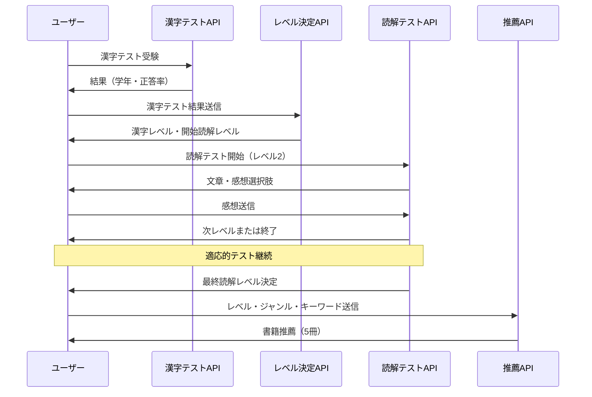

# テストフロー仕様書

## 概要

コナンゼミ選書システムでは、以下の3段階のテストフローを通じてユーザーに最適な書籍推薦を行います：

1. **漢字テスト**（6段階）→ 漢字レベル決定（3段階）
2. **読解テスト**（適応的テスト）→ 読解レベル決定（3段階）
3. **書籍推薦**（5冊推薦）

## フロー詳細

### 1. 漢字テスト段階

#### API: `/api/kanji-test`

**目的**: ユーザーの漢字習得レベルを6段階（1-6年生）で測定

**実装状況**:
- ✅ 6段階のテスト問題（1年生～6年生）が完備
- ✅ 各学年5問の問題が用意済み
- ✅ 採点機能実装済み

**出力**:
```json
{
  "grade": 4,
  "correctCount": 4,
  "totalQuestions": 5,
  "accuracy": 80
}
```

### 2. レベル変換段階

#### API: `/api/determine-reading-level`

**目的**: 漢字テスト結果を読解テスト用の3段階レベルに変換

**変換ロジック**:
- **正答率80%以上**: 該当学年レベルまたは上位レベル
- **正答率60-79%**: 該当学年レベル
- **正答率60%未満**: 下位レベルに調整

**変換表**:
| 受験学年 | 正答率80%+ | 正答率60-79% | 正答率60%未満 |
|----------|------------|--------------|---------------|
| 1-2年生  | 低学年     | 低学年       | 低学年        |
| 3年生    | 中学年     | 中学年       | 低学年        |
| 4年生    | 中学年     | 中学年       | 中学年        |
| 5年生    | 高学年     | 高学年       | 中学年        |
| 6年生    | 高学年     | 高学年       | 高学年        |

**出力**:
```json
{
  "kanjiLevel": "中学年",
  "startingReadingLevel": 2,
  "explanation": "4年生レベルの漢字テストで80%の正答率でした。中学年レベルの読解テストに進みます。",
  "nextStep": "reading-test"
}
```

### 3. 読解テスト段階

#### API: `/api/reading-test`

**目的**: 決定された漢字レベル内で最適な読解レベルを適応的に決定

**テスト方式**: 適応的テスト（CAT: Computer Adaptive Testing）

**開始レベル**: 必ず真ん中のレベル（2）から開始

**例文マトリックス**:
```
           読解レベル1    読解レベル2    読解レベル3
低学年     ひらがな中心   基本漢字      やや長い文章
中学年     基本説明文     社会的内容    論理的説明
高学年     具体例あり     抽象概念      複雑な問題
```

**適応ロジック**:
```
ユーザー感想 → レベル調整
- とてもかんたん   → +2レベル
- すこしかんたん   → +1レベル  
- ちょうどよい     → テスト終了
- すこしむずかしい → -1レベル
- とてもむずかしい → -2レベル（最下位で止まる）
```

**終了条件**:
- ユーザーが「ちょうどよい」を選択
- レベル上限/下限に達してそれ以上調整できない
- 同一レベルに留まった場合

**出力**:
```json
{
  "kanjiLevel": "中学年",
  "determinedReadingLevel": 2,
  "testProgress": {
    "isComplete": true,
    "nextStep": "proceed-to-recommendation"
  }
}
```

### 4. 書籍推薦段階

#### API: `/api/recommendations`

**入力**: 
- `kanjiLevel`: "低学年"/"中学年"/"高学年"
- `readingLevel`: 1-3
- `selectedGenres`: ユーザー選択ジャンル
- `userKeywords`: LLM抽出キーワード

**推薦戦略**: 5冊推薦
1. ビタ刺し推薦（フィクション）- 小学館
2. ビタ刺し推薦（ノンフィクション）- 一般
3. 興味拡張推薦（フィクション）- 一般
4. 興味拡張推薦（ノンフィクション）- 小学館
5. ランダム推薦

**フィルタリング**: 漢字レベルで厳密にフィルタリング後、読解レベルで適合度計算

## API連携フロー



## 実装状況サマリー

### ✅ 完了
- 漢字テスト（6段階問題・採点）
- 読解テスト（9パターン例文・適応的調整）
- レベル変換API
- 推薦システム（新フォーマット対応）

### 📝 データ充実度
- **漢字テスト問題**: 6学年 × 5問 = 30問 ✅
- **読解テスト例文**: 3漢字レベル × 3読解レベル = 9例文 ✅
- **書籍データ**: 各レベル・ジャンル組み合わせで十分な数が必要

### 🔄 フロント連携ポイント
1. 漢字テスト完了 → `/api/determine-reading-level`呼び出し
2. レベル決定 → 読解テスト開始（レベル2固定）
3. 読解テスト完了 → 推薦システム呼び出し
4. 各段階でユーザーフィードバック表示

## テスト用エンドポイント

開発・デバッグ用のGETエンドポイントが各APIに用意されています：

- `GET /api/determine-reading-level?grade=4&accuracy=80`
- `GET /api/reading-test?kanjiLevel=中学年&readingLevel=2`
- 等々

## エラーハンドリング

各段階で適切なフォールバック処理を実装：
- データ不足時のデフォルト値設定
- 無効入力時の適切なエラーメッセージ
- テスト中断時の復旧機能考慮 